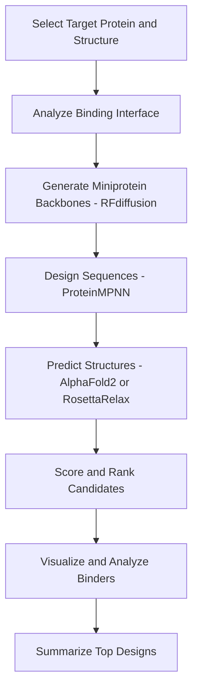

# Save the README.md without using problematic markdown symbols like triple backticks or mermaid blocks

readme_final_cleaned = """# 🧬 De Novo Miniprotein Binder Design with RFdiffusion + Rosetta

**Author:** [Your Name]  
**Project Type:** Generative AI + Computational Protein Design + Structural Bioinformatics  
**Status:** 🚧 In Progress  
**Estimated Time:** ~6–8 weeks (1 hour/day)

---

## 📍 Project Overview

This project demonstrates the use of state-of-the-art AI tools to design novel miniprotein binders from scratch, targeting a therapeutically relevant protein. The pipeline integrates RFdiffusion for backbone generation, ProteinMPNN for sequence design, and Rosetta/AlphaFold2 for structure refinement and ranking.

This is a step-by-step, fully documented learning project aimed at:
- Gaining practical experience with generative protein design workflows
- Understanding binder-target interactions
- Building a public portfolio that shows ML + structural bioinformatics integration

---

## 🎯 Objectives

- Select a therapeutic target with available 3D structure (e.g., IL-6, HER2, PD-1)
- Generate candidate binder backbones with RFdiffusion
- Design sequences with ProteinMPNN
- Predict/refine final binder structures using AlphaFold2 or RosettaRelax
- Rank and filter binders based on scores (pLDDT, Rosetta energy, interface quality)
- Visualize binding interfaces and structural quality with PyMOL
- Maintain a clean, reproducible, and documented GitHub project

---

## 🛠️ Tools and Technologies

| Tool/Library             | Purpose                                                |
|--------------------------|--------------------------------------------------------|
| RFdiffusion              | Backbone generation toward target structure            |
| ProteinMPNN              | Sequence design for generated backbones                |
| AlphaFold2 / ColabFold   | Structure prediction for designed sequences            |
| RosettaRelax / Rosetta scoring | Structure refinement and ranking                 |
| PyMOL / ChimeraX         | Structural visualization of binders and complexes      |
| Python + NumPy + Matplotlib | Data analysis, scoring, visual plots              |
| Git + GitHub             | Version control and documentation                      |

---

## 🎯 Target Protein

Target: To be selected (e.g., HER2, IL-6, PD-1)  
PDB ID: To be defined  
Why: Known therapeutic relevance, structural data available

---

## 🧭 Workflow Summary

---

## 🗂️ Folder Structure

miniprotein-binder-rfdiffusion/  
├── README.md  
├── .gitignore  
├── data/  
│   ├── target/  
│   └── rf_backbones/  
├── notebooks/  
│   └── 01_target_analysis.ipynb  
├── scripts/  
│   └── run_protein_mpnn.py  
├── results/  
│   ├── sequences/  
│   ├── structures/  
│   └── analysis/  
└── logs/  

---

## 📌 Commit Progress

- Initial commit: project structure and README  
- Added HER2 target PDB and sequence data  
- Generated RFdiffusion backbones  
- Designed sequences with ProteinMPNN  
- Predicted 3D structures with AlphaFold2  
- Scored and ranked designs with Rosetta  
- Added visualizations and summary plots  

---

## 📈 Outcomes & Learnings

- Top binder sequences with highest pLDDT / lowest Rosetta energy  
- Interface analysis and contact maps  
- Reflections on RFdiffusion usability and binder design challenges  

---

## 📚 References

- https://github.com/RosettaCommons/RFdiffusion  
- https://github.com/dauparas/ProteinMPNN  
- https://colab.research.google.com/github/sokrypton/ColabFold/blob/main/AlphaFold2_mmseqs2.ipynb  
- https://www.rosettacommons.org/  
- https://www.rcsb.org/  

---

This project is a part of a series of portfolio projects focused on AI-driven protein design for drug discovery and biotechnology.
"""
